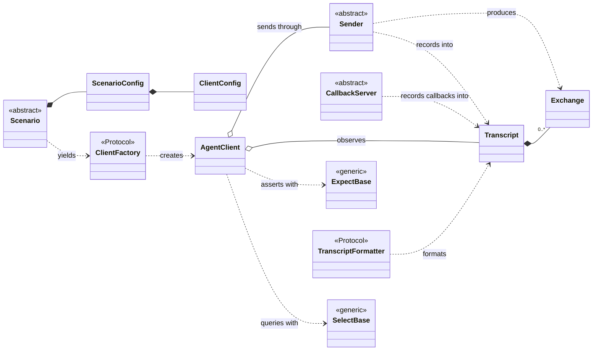
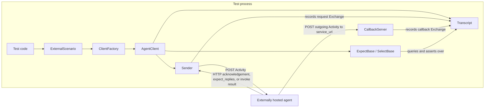
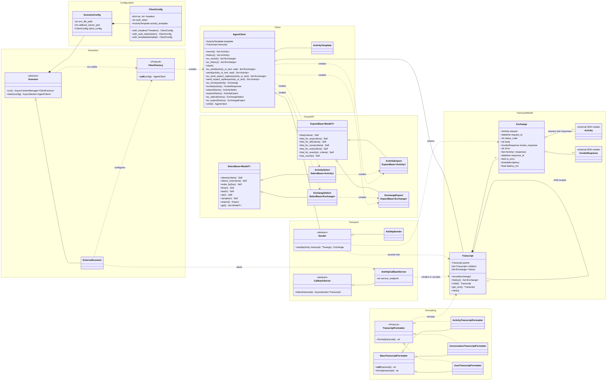
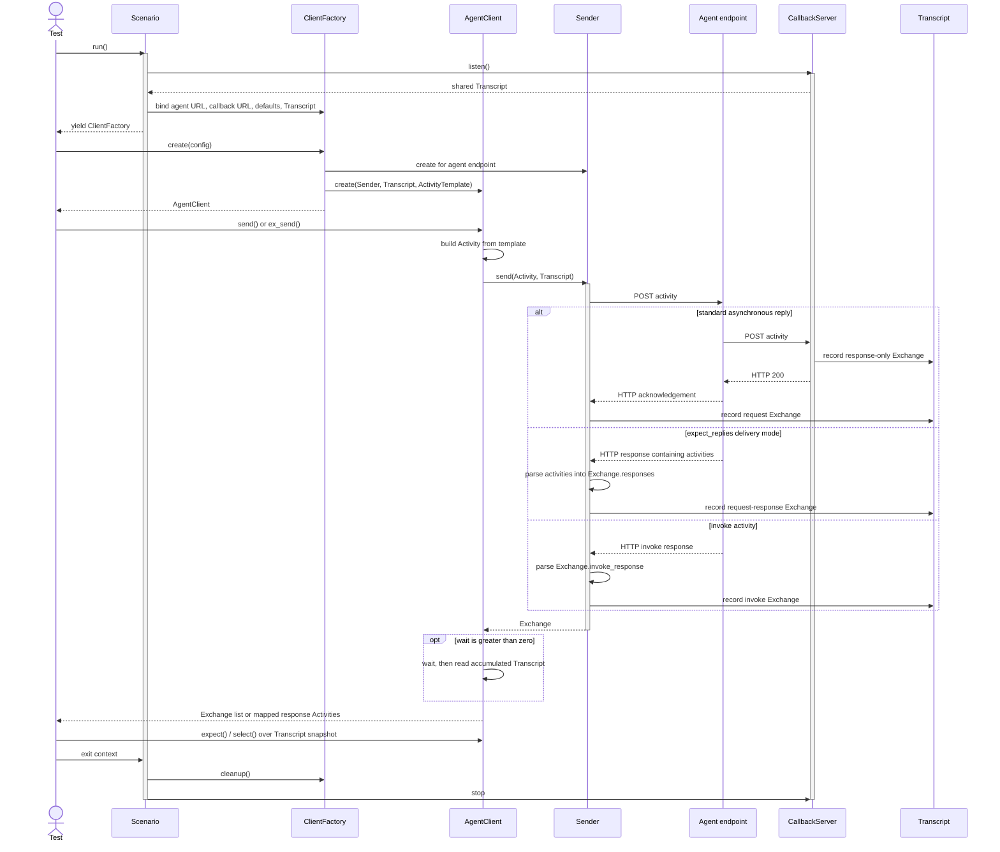

# Microsoft Agents Testing model

This model describes the main runtime contracts in `microsoft_agents.testing`,
their concrete implementations, and the data that moves between them. Solid
arrows represent inheritance, dotted arrows represent protocol implementation
or use, diamonds represent ownership, and plain arrows represent creation or
data flow.

## Abstractions at a glance

## External agent interaction

## Structural model

## Runtime interaction

The scenario owns the test-infrastructure lifetime. It starts the callback
server and yields a factory whose clients share the callback transcript.
Standard replies arrive as separate callback exchanges, while
`expect_replies` activities and invokes are represented by the HTTP exchange.

## Scope notes

The model includes supporting contracts and public types needed to make the
remaining relationships complete:

- `ClientFactory`, the contract yielded by every `Scenario`.
- `AiohttpSender` and `AiohttpCallbackServer`, the concrete transport pair.
- `ActivityTemplate` and the typed `Activity*` / `Exchange*` fluent wrappers
  exposed by `AgentClient`.
- The three built-in transcript formatter implementations.

`ScenarioRegistry` and CLI/pytest integration are intentionally outside this
runtime model. They discover and inject scenarios but do not alter the core
scenario-client-transport-transcript contracts. They would be the next useful
diagram if package registration and test-runner integration need documenting.
