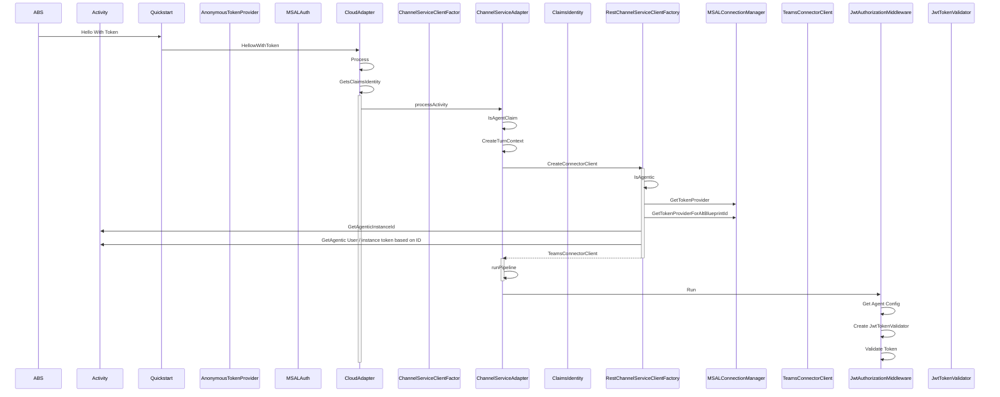

```mermaid
    sequenceDiagram
    participant ABS
    participant Activity
    participant Quickstart
    participant AnonymousTokenProvider
    participant MSALAuth
    participant CloudAdapter
    participant ChannelServiceClientFactor
    participant ChannelServiceAdapter
    participant ClaimsIdentity
    participant RestChannelServiceClientFactory
    participant MSALConnectionManager
    participant TeamsConnectorClient
    participant JwtAuthorizationMiddleware
    participant JwtTokenValidator

    ABS->>Quickstart: Hello With Token
    Quickstart->>CloudAdapter: HellowWithToken
    CloudAdapter->>CloudAdapter: Process
    CloudAdapter->>CloudAdapter: GetsClaimsIdentity

    activate CloudAdapter
    CloudAdapter->>ChannelServiceAdapter: processActivity
    ChannelServiceAdapter->>ChannelServiceAdapter: IsAgentClaim
    ChannelServiceAdapter->>ChannelServiceAdapter: CreateTurnContext
    ChannelServiceAdapter->>RestChannelServiceClientFactory: CreateConnectorClient
    
    activate RestChannelServiceClientFactory
    RestChannelServiceClientFactory->>RestChannelServiceClientFactory: IsAgentic
    RestChannelServiceClientFactory->>MSALConnectionManager: GetTokenProvider
    RestChannelServiceClientFactory->>MSALConnectionManager: GetTokenProviderForAltBlueprintId
    RestChannelServiceClientFactory->>Activity: GetAgenticInstanceId
    RestChannelServiceClientFactory->>Activity: GetAgentic User / instance token based on ID    
    RestChannelServiceClientFactory-->>ChannelServiceAdapter: TeamsConnectorClient
    deactivate RestChannelServiceClientFactory

    activate ChannelServiceAdapter
    ChannelServiceAdapter->>ChannelServiceAdapter: runPipeline
    deactivate ChannelServiceAdapter
        ChannelServiceAdapter->>JwtAuthorizationMiddleware: Run
        JwtAuthorizationMiddleware->>JwtAuthorizationMiddleware: Get Agent Config
        JwtAuthorizationMiddleware->>JwtAuthorizationMiddleware: Create JwtTokenValidator
        JwtAuthorizationMiddleware->>JwtAuthorizationMiddleware: Validate Token


    deactivate CloudAdapter

```